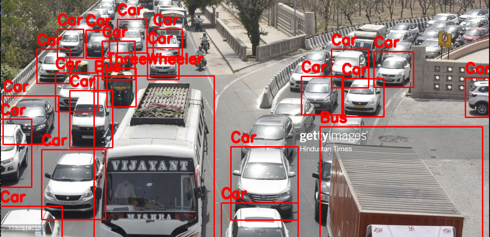

# vehicle_speed_estimation

In this project, yolov4 is used for custom vehicle detection (detecting cars, bikes, trucks, buses)

Architecture:

Later computer vision used for estimating speed
In this, taking the object first and getting the centroids of the detected object

This is how the vehicle detection looks like:

later going frame by frame and analyzing the pixel difference created by the vehicle
later we use this difference to calculate pixel per frames and with that, we can easily come up with a speed 

Speed Estimation

ppm = pixel per meter
d_pixels = distance of location1 - location2
d_meters = d_pixels / ppm
fps = 30 (keeping)
speed = d_meters * fps * 3.6

finally multiplying it by 3.6 because we want to see the output in km/h, not in m/s

Where: d_pixel: distance between two positions of detected car.

in this case, to getting pixel per frame, we are simply counting the pixels passed by vehicle in 1min 

and later we can get the full speed to the vehicle to simplify this and getting the distance between two positions I am using our famous distance formula between two coordinates

dist_pixel = math.sqrt((x1-x2)**2 - (y1-y2)**2)

and getting the distance between two points or better call it the number of pixels between two points 

